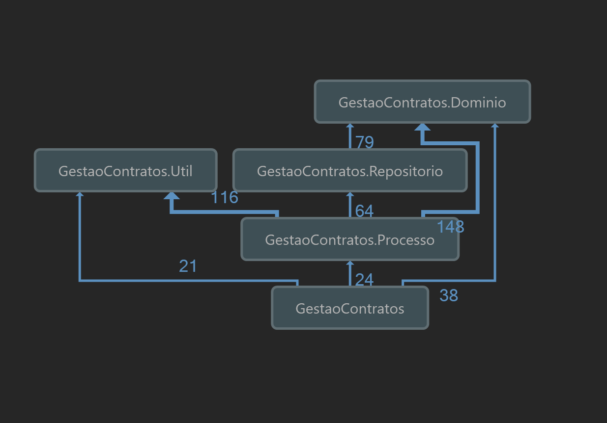

[ _DRAFT_ ]

[Jornada](jornada)

---

## Testes usando ambiente de desenvolvimento

---

```
git checkout v1.8
```

`v1.8` Refatorar código dividindo em camadas

Alterações:
- Criados quatro novos projetos:
- - `GestaoContratos.Processo`
  - `GestaoContratos.Dominio`
  - `GestaoContratos.Repositorio`
  - `GestaoContratos.Util`
- A classe estática `Repositorio` foi dividida em duas:
  - `ContratoRepositorio`
  - `PedidoRepositorio`
- As regras de negócio foram movidas para as classes de processo, com isso será possível testar diretamente as classes de processo.
- A refatoração feita foi apenas na estrutura das classes, não houve refatoração de funções



---

```
git checkout v1.9
```

- Criada a classe `RepositorioBase`
- Arquivo de banco de dados movido para a pasta do Repositório
- Criada a variável de conexão com o banco
- Criados os mesmos testes do front agora direto nas classes de processo

---

```
git checkout v2.0
```

[TO-DO] `v2.0` Resolver problema de estado inicial